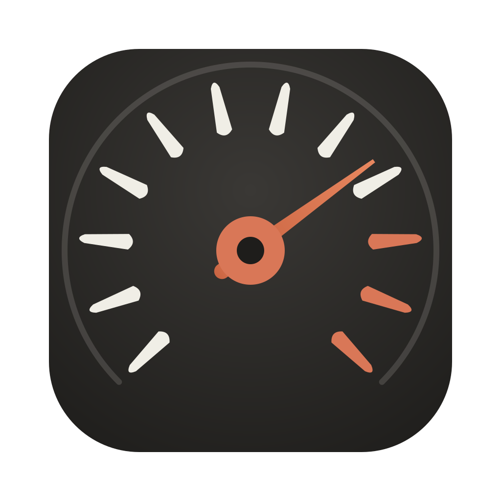
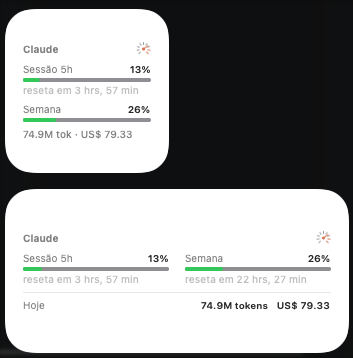
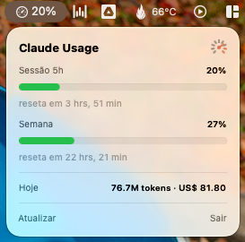

<p align="center">
  
</p>

<h1 align="center">Claude Usage — macOS Desktop Widget</h1>

<p align="center">A native WidgetKit desktop widget showing your claude.ai plan usage and today's token spend, straight on your Mac desktop.</p>

> **Unofficial project.** Not affiliated with or endorsed by Anthropic. It reads the credentials your local Claude Code installation already maintains and talks only to `api.anthropic.com`.

*Leia em [português](README.pt-BR.md).*

## What it shows

<p align="center">
  
  
</p>

- **Session (5h)** and **weekly** plan limits — the same percentages `/usage` shows in Claude Code, with live-updating reset countdowns.
- **Today** — tokens and estimated cost (USD), computed locally from Claude Code's JSONL transcripts in `~/.claude/projects`.
- A ⚠️ *stale* badge when data is older than 20 minutes (app not running, network down, token expired).
- **Menu bar too**: the agent app shows a speedometer with the current session % in the menu bar; click it for a panel with both gauges, reset countdowns, today's spend and a refresh button.
- **Localized**: English, Português (BR), Español, Français, Deutsch, 日本語, 简体中文 — follows your system language (translations live in `Shared/Localizable.xcstrings`; PRs adding languages are welcome).

## How it works

```
ClaudeUsage.app (LSUIElement agent, non-sandboxed, login item)   ClaudeUsageWidget.appex (sandboxed)
  every ~5 min (NSBackgroundActivityScheduler):                    TimelineProvider:
  1. read Claude Code's OAuth token from the login Keychain          reads snapshot.json from the
  2. GET https://api.anthropic.com/api/oauth/usage        ──────▶    App Group container and renders
  3. scan today's JSONL transcripts (dedup + pricing)      App       systemSmall / systemMedium views
  4. write snapshot.json atomically                       Group
  5. WidgetCenter reload (only when something changed)   container
```

The widget extension is sandboxed (WidgetKit requires it), so the containing app does all the work and the widget only renders a cached snapshot.

### Security notes

- The OAuth **access token never leaves your machine** except to `api.anthropic.com` (the official usage endpoint).
- The **refresh token is never used** — refreshing would rotate it and log Claude Code out. The app only re-reads whatever token Claude Code maintains.
- Nothing else is collected, stored, or transmitted.

## Requirements

- macOS 15+ (built and tested on macOS 26)
- Full Xcode (from the App Store) with any Apple ID added in *Xcode → Settings → Accounts* (a free Personal Team is enough)
- [XcodeGen](https://github.com/yonaskolb/XcodeGen): `brew install xcodegen`
- [Claude Code](https://claude.com/claude-code) installed and logged in (it is the source of both the token and the transcripts)

## Install

```bash
git clone https://github.com/ohenriquet/claude-usage-widget.git
cd claude-usage-widget
./build.sh        # detects your Team ID, generates the project, builds, signs, installs to /Applications
```

On first launch macOS asks for Keychain access → click **Always Allow**.
Then right-click the desktop → **Edit Widgets** → search for "Claude" and drag the small or medium widget out.

`build.sh` options: `TEAM_ID=XXXXXXXXXX ./build.sh` to set the signing team explicitly.

## Troubleshooting

- **Widget missing from the gallery** — make sure exactly one copy of the app exists (in `/Applications`), launch it once, then `killall NotificationCenter chronod`. Last resort: log out/in.
- **Keychain prompt reappears** — normal when Claude Code recreates its credentials item (some token refreshes/logins). One click fixes it.
- **Numbers differ slightly from ccusage** — token dedup keeps the entry with the highest `output_tokens` per `message.id + requestId`; `<synthetic>` entries are skipped; per-line `costUSD` is preferred when present.
- **Persistent 429** — the fetch sends a `claude-code` User-Agent and polls every 5 minutes; if you still hit it, the widget keeps showing the last good snapshot with the stale badge.

## Regenerating the icon

The icon (a sports-car tachometer with Claude-style rays) is a single SVG:

```bash
brew install librsvg
cd Assets && mkdir -p AppIcon.iconset
# render each size from icon.svg, then:
iconutil -c icns AppIcon.iconset -o ../App/AppIcon.icns
```

## License

[MIT](LICENSE)
